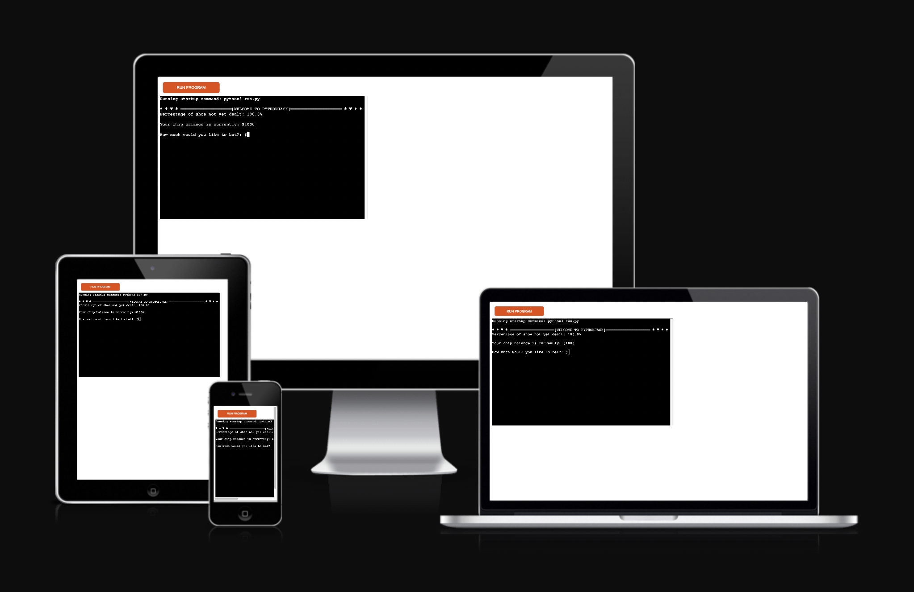
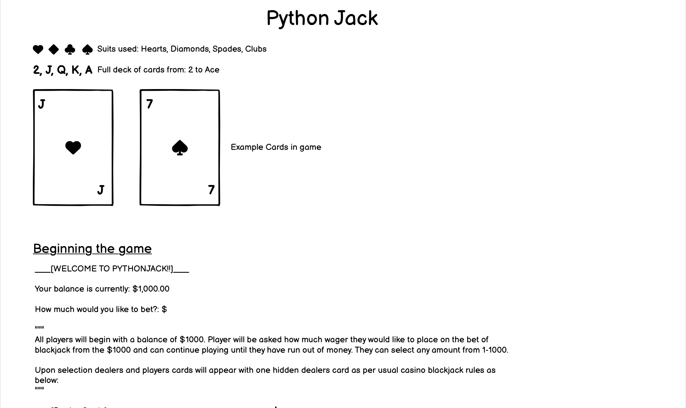
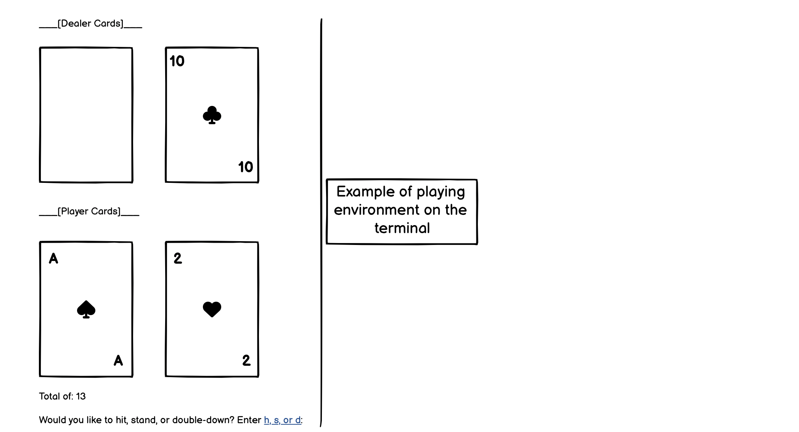
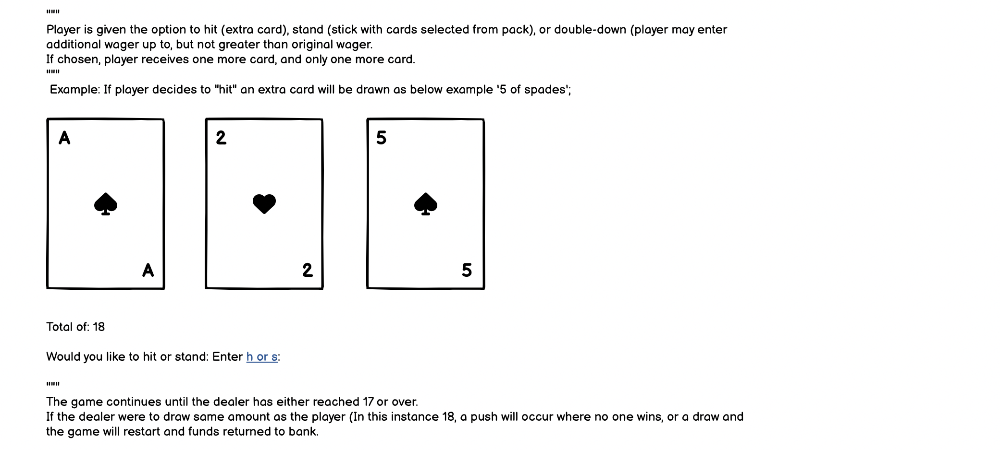
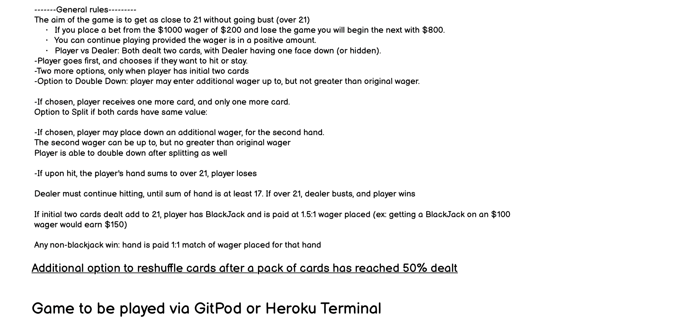

Welcome jonathanwhitedev,

This is the Code Institute student template for deploying your third portfolio project, the Python command-line project. The last update to this file was: **August 17, 2021**

## Reminders

* Your code must be placed in the `run.py` file
* Your dependencies must be placed in the `requirements.txt` file
* Do not edit any of the other files or your code may not deploy properly

## Creating the Heroku app

When you create the app, you will need to add two buildpacks from the _Settings_ tab. The ordering is as follows:

1. `heroku/python`
2. `heroku/nodejs`

You must then create a _Config Var_ called `PORT`. Set this to `8000`

If you have credentials, such as in the Love Sandwiches project, you must create another _Config Var_ called `CREDS` and paste the JSON into the value field.

Connect your GitHub repository and deploy as normal.

## Constraints

The deployment terminal is set to 80 columns by 24 rows. That means that each line of text needs to be 80 characters or less otherwise it will be wrapped onto a second line.

-----
Happy coding!

# Python Jack BlackJack Game

View my live project here! [Santa's Big Christmas Quiz](https://jonathanwhitedev.github.io/santa-quiz/) 

Python Jack is a interactive app based website providing a terminal to play the popular casino game BlackJack. This condensed easy to read, easy to play game can provide lots of fun to practice the game without using real money. 

Players of the game are given a $1000 playing amount and can bet against and compete with the computer. 

The following responsive screensizes of my website can also be found here: (https://ui.dev/amiresponsive?url=https://jonathanwhitedev.github.io/voyager/index.html)

## How to play Python Jack

Standard casino rules:

-__Player is given a $1000 kitty added to their bank at the start of the game, this can be used in increments any increments of $1 to the full $1000. A waged bet of any amount ($1000) starts the game__

-__Player vs Dealer:__

-__Both dealt two cards, with the Dealer having one face down (hidden).__

-__Player goes first, and chooses if they want to hit or stay using the "H" or "S" key on keyboard.__

-__Double Down option:__
Player may enter additional wager up to, but not greater than original wager.
If chosen, player receives one more card, and only one more card.
Option to Split if both cards have same value:
If chosen, player may place down an additional wager, for the second hand.
The second wager can be up to, but no greater than original wager
Player is able to double down after splitting as well.

-__If upon hit, the player's hand sums to over 21, player loses.__

-__Dealer must continue hitting, until sum of hand is at least 17. If over 21, dealer busts, and player wins!__

-__If initial two cards dealt add to 21, player has BlackJack and is paid at 1.5:1 wager placed (eg: getting a BlackJack on an $100 wager would earn $150)__

-__Any standard win(not BlackJack): the hand is paid 1:1 as a match of wager placed for that hand.__

-__Your bank is updated after each game through wins and losses__

-__Player may leave the game with winnings at the end of any settled bets.__

## User Stories and UX

- __As a visiting user, I would like a Casino themed game readily available.__

As part of the UX specification and planning phase it was noted that there was a lack of free resources to play and practice games such as blackjack online in a safe enviroment, totally add free .

- __As a visiting user, I would like free blackjack related games.__

Over three quarters of those surveyed (100), also came to agreement there were not many quizes online that were free. Many required signing up, and/or applications that wanted money for generated quizes on apps through App Store or Google Play, of which many were very poorly rated. Santa's Big Christmas Quiz will remain free to all and readily available to all who seek it.

- __As a visiting user, I would like something easy to use.__

Another shortfall noted was that many casino games such as blackjack online were extremely spam orientated, with many adverts spilling into the quiz and detracting the user from reading them accurately. Even if some websites had little to no adverts, they were often jumbled and messy, or too full of distracting information that was not clean and easy to use. It was also observed that most users wanted a website that could be read on a mobile or tablet rather then a computer that had easy to read fonts no matter the display used. Almost all that were surveyed in the UX consulation stage agreed there was no one webbased format that provided an easy to use game online.

- __As a visiting user, I would like my scores to be calculated.__

Many of the people surveyed agreed they wanted a game that saved their progress after each tune of the game. We aim to make a simple scoring function that can handle complex additions easily and make readily availabe to the user.

## Terminal (GitPod)
The built in Terminal in GitPod can be used to play this game. This was used for extensive testing of the game for deployment to Heroku.

## Terminal (Heroku)

The deployed project is playable via Heroku as shown below. This is the area visiters of the site will play. 

## Features 

Python Jack includes the following;

### Existing Features

- __Balance__ 

  - At the beginning of every game, a print statement of current balance will be shown to the player to indicate their value of chips. The player will automatically be shown a balance of $1000 at the very beginning of the game. As the player progresses this will recalculate depending on winnings and losses and will update at the end of every game. The new balance will be shown to the player at the start of the next game versus the dealer. If the player losses all their money it will be game over and a message to confirm this will appear.

   

- __Another round__ 

  - When a player finshes a game they will be given the print message of "Would you like to play another round? Y/N" The player can select from keyboard either the Y or N key to continue or finish.

- __Cards__ 

- At the start of a game the player will be able to see their cards and the total calculated value of these cards. The dealers cards will also appear above the players.

- __Hidden Dealers Card__ 

- As with any BlackJack game, the dealers last card will always be hidden from the players view and this be displayed as the rearside of the playing card.

- __Hit, Stick, Double Down__ 

- As with any BlackJack game, the player has options to Hit (Ask for another card), Stick (stay with the cards and their values), or double down (bet more chips on this turn). A print statement will appear after the cards are drawn to confrim what player would like to do.

    

### Future features Left to Implement

- A propmt to ask for users name, this could be used to keep highscores saved into a server so that others can compete against them.
- A login for users to save their details of winnings so they can use these again in future games could also be implemented.

## Typography and Colour

- Typography was taken from Google Fonts using 1 base font, "Cormorant Garamond" and "Anton" for 1 text element for the score. I felt this complimented the Christmas theme well, was clean and clear to read and easily accessible. With colour schemes I chose to use 3 Christmas themed colours, Red, Gold and Blue. Being mainly primary colours these work very well together and make the style eye catching. These were applied using hex, red (#7c0017), gold (#d7be69) and blue (#3b81d6c6). Then Black (#000000) and White (#ffffff) were used for the typography for Questions and Buttons.

Google Fonts can be found here (https://fonts.google.com/)

## Wireframes
- I used Balsamiq for my wireframes and drew a rough design of what I wanted my layout to look like with responses. the cards were hard to repliocate but the location of the playing in the terminal should be correct.

Suits and Card Layout

Playing Table

In Game

Game Rules

## Technology
__Various technologies were used in the entire process of building this website as follows;__
- Balsamiq. This was used to make a rough template of the design of my website.
- GitHub. To build the repository for Voyager and lay the groundwork for its development and deployment of website.
- GitPod. Where the design came to life in the physical coding of the website building the files and folders and writing the code to commit back to GitHub. This beginning of this Readme file was written before coding took place and extra folders were added for HTML and Assets including CSS and media.
- HTML. The building block for all the code and written across 5 pages, index, about, spotlight, signup, welcome.
- CSS. The style of the website linked via stylesheets to the HTML code.
- JavaScript. Used for all the questions and variables of the quiz, including calculating the score through additions, changing the colour of the question "Green" for correctly answered and "Red" for incorrect answered questions. Additionally, functions were added to change the image and text depending on the Results score.
- Fontawesome. Used to take social media icons for the bottom of the results page.
- Google Fonts. All font styles were taken to add a more unique design.
- Google images. Images taken from searching for Santa cartoon images and of bad santa.
- W3 Validator. Used to ensure all HTML code was working with no errors.
- Jigsaw Validator. USed to ensure all CSS code met best practices and was working with no errors.
- Lightouse. Used to ensure testing of performance met expectations wit no severe errors or performance issues. 
- JS Hint. This was used to test the functionality of my javascript codes and functions and to ensure nothing was returning errors.

## Testing 

Overall, I am very happy with the testing outcomes with lighthouse, HTML, and CSS validation. Js Hint was an invaluable tool to help make sense of javascript when certain functions were not performing as expected and would give you guidance on how to fix or improve. I had a couple of intances where I had not properly assigned a function, so this as extremely handy as a reminder.
Jigsaw spotted anothe error I rectified where i was using "padding auto" on a button on line 210 of my CSS file which does nothing! This was swiftly removed as was causing validation issues.
I have tested this website on a macbook pro with a 32 inch external monitor, an Ipad Pro, and a Iphone 13 pro max. I have also used reponsive design in Google dev tools with other devices such as a Surface Duo, Samsung galaxy devices including the fold'.
The CSS code was written first and foremost for a smartphone to save on time and to also accept that many people now use hones as a preferred way to browse the web. The ability to be scaled up with media queries for bigger devices when required.I made one small media query to enhance playing the game on bigger devices past 750px width.

The website runs smoothly across all used devices with no glitches or errors.

### Performance Testing 

- Lighthouse (Chrome Dev Tools)
  - Some "Best Practices" issues were returned when passing through Lighthouse on google chrome dev tools [https://developer.chrome.com/docs/lighthouse/overview/] on both the index landing page and the quiz pages. However scores of over 97% were present throughout on Performance, Accessibility and SEO.
  - I addressed the issues with best practices by removing the font awesome cookies that was attached to the link and href of the index and quiz html pages. These were returning data that google lighthouse was scoring badly.
  - I addressed the issues further by adding "meta http-equiv="Permissions-Policy" content="interest-cohort=() on line 9 of index and quiz pages as previously lighthouse was reporting an issue with permissions policy. I found this added meta tag on google after searching for the problem. After adding this the errors went away.
  - With these updated changes the score was improved to 92% as you can see in the screenshots below: 

  Index Page
 

  Quiz Page (Game Area)
 

### JavaScript Testing 

- Js Hint
  - There were a few issues with JS hint i had to learn to encounter which are highlighted here:
  - I had forgotten in one instance to apply a function correctly on line 122 "initializeQuiz" this helped me realise i had forgotten to add an event listener, which was then swiftly added!
  - I kept getting a ES6 issue with using const variables in my code for the questions (19 errors!) i added /*jshint esversion: 6 */ on line 1 of the script.js and questions.js file after googling the issue whivh was only related to js hint. I left in place in the code as wasnt affecting the website.

  All JS code (Combined questions and functions pages)
 

### Validator Testing 

- HTML
  - No errors were returned when passing through the official  on all pages of website as follows: 

 
 

- CSS
  - No errors were found on completion when passing through the official 

  
 

### Test Cases
__Index Page Testing:__
1. User hovers over on the Begin option on the landing index page. A curser pointer hand will be displayed. User should be redirected to Quiz start page first question when clicked upon. Working as expected every time.

 
 

 __Social Link Testing:__
 1. User hovers over any of the 3 social media links at bottom of page on Inde Landing page and also the Results pages of the end of the quiz. A curser pointer hand appears directly over the link.
 2. A pop up text also appears on hover that displays a message that the website will open on in a new tab. 
 3. When clicked upon any of the 3 links, it will open in a seperate new tab.
 4. All testing was completed, and all was working satisfactory.
 5. See Screenshots below of test outcomes.

 
 

 __Quiz Button Testing:__
 1. User clicks on any answer button between (A-D) in the "Quiz" page, this was tested for fast accurate response to move to the next question.
 2. When user clicks on a correctly answered question the span of the button will change colour to 'Green' before moving to next question, this is working correctly only on the correct answers.
 3. When user clicks on a incorrectly answered question the span of the button will change colour to 'Red' before moving to next question, this is working correctly only on the incorrect answers.
 4. "Skip Question" button works to provide an easy way of skipping the question without answering it. This will prevent the user picking up any points and a total of none will be given if every question is subsequently skipped. This is working as expected.
 5. "Check Answers" button appears on the scorecard at the end of the quiz and works correctly, displaying all the correct answers for the questions in a new container.
 6. "Restart Quiz" also appears on scorecard and answer cards at the end of the quiz. These correctly move the user back to question 1 of the quiz.

__Scoring System for Image and Text Scorecard Testing:__
 1. User plays the quiz of 15 questions and depending upon the results gets given a different image/text scorecard based on final calculation (3 Images/3 Texts total) All 3 of these outcomes have been tested extensively ranging from deliberately scoring every score between 1 -15 correctly with no issues found.
 2. If the player gets a score of 7 or less (<=7) BAD SANTA! appears with the image from the film bad santa.
 3. If the player gets a score of 14 or less (<=14) SANTA BABY! appears with the relavent image.
 4. If the player gets a maximum score of 15 (default score)) YOU'RE A WINNER! appears with the relavent image.

### Supported Browsers and Screen Sizes.
  - Testing was carried out on Google Chrome, Safari, and Mozilla Firefox. All rendered the content and was fast and reponsively across these browsers.
  - Testing was carried out on Macbook Pro M1, Ipad Pro, and Iphone 13 Pro Max models in personal collection. 
  - There is one media query stepping up sizes after hitting a minimum width of 750px. I designed this mostly as a mobile first application.

### Unfixed Bugs

There were no bugs present that were unfixed. There were some recommendations that there were some unused variables in JSHint however these are not being used as JavaScript functions but for styling purposes in CSS. 

## Deployment
  - The site was deployed to GitHub pages. The live link can be found here - https://github.com/jonathanwhitedev/santa-quiz

  __To deploy the project:__
   1. In the [GitHub repository](https://github.com/jonathanwhitedev/santa-quiz), Navigate to the settings tab (small red box in image below).
   2. Once in the settings, navigate to the pages tab on the left hand side.
   3. In the build and deployment section under Branch, select the "master" branch and click Save.
   4. Once the master branch has been selected, the page will be automatically refreshed and a display indicates the successful deployment and the link to the address as below (large red box).

   

__To open Gitpod and Voyager website preview:__
   1. In the [GitHub repository](https://github.com/jonathanwhitedev/santa-quiz), click the green Gitpod button. This will open GitPod.
   2. Once in GitPod, click the tab hamburger button in top left corner, navigate to Terminal and highlight and click "New Terminal".
   3. In the Terminal after gitpod/workspace/santa-quiz, type the following command "python3 -m http.server" and hit the enter key.
   4. Once entered correctly a pop up will appear in bottom left corner displaying a service port is available. Click "Open Browser" and the website preview will open in a brand new tab.
   5. All steps pictured below and highlighted in red boxes.

   
   
   

### Extra Deployment Tasks
 __To run the website on a local screen:__
   1. Go to the [GitHub repository](https://github.com/jonathanwhitedev/santa-quiz).
   2. Once in there, click on the green Code button and Download ZIP.
   3. Extract the ZIP file on your local machine.
   4. Run the index.html file in a browser.
   5. All steps pictured below with red highlighted boxes.

   

 __To clone the repo:__
   1. Go to the [GitHub repository](https://github.com/jonathanwhitedev/santa-quiz).
   2. Click on the green Code button and directly underneath as shown, copy the HTTPs link there.
   3. Open a GitBash terminal and navigate to the directory where you want to locate the clone.
   4. Type "git clone" and paste the copied HTTPs link, press the enter key to begin the clone process.

   

## Credits 

I will firstly like to credit my fiancé, Toni, for this website and motivating me to get over the line and by taking on more domestic tasks! I was not in a particularly brilliant headspace with less then 2 weeks from finishing JS modules in the elearning to submission. I'd felt the strain of the learning and did not feel confident with handling javascript at all. She was very supportive and this quiz idea relating to christmas was hers. She had already made a question bank from the previous christmas for a company party backed up and saved in her work laptop. These answers were all verified and accurate and were extremely handy to use in this quiz! 

 I found a simple quiz project builder on google at https://simplestepscode.com/javascript-quiz-tutorial/ which helped find the basics of making this quiz and took my own spin on it with this finshed result. With thanks to them for their publication in helping me break it down step by step.

Lastly I would like to thank my mentor, Rohit, for helping impeccably as always with his wisdom and guidance which was very helpful and greatly appreciated indeed.

Content and media inspiration is as follows below;

### Content 

_ All of the ideas in relation to this quiz including format, image selection, colour schemes were all my own. However the following helped me get there:

- The social icons in the bottom of section of all pages were taken from [Font Awesome](https://fontawesome.com/)
- The webkit stroke function was found after heavy research in needing a solution to allow text to pop off the background to be unique and more readble against the background colours in the scorecards, this was found at (https://css-tricks.com/adding-stroke-to-web-text/) I then incorporated this into my css for my specific needs.

### Media

- All of the Images used on all pages were found on google images (http://google.co.uk/search) these were then resaved as different file names, as text was either in alternate language to english or had spaces and would fail testing or reading for other developers.

## Thank you for taking the time to view my README file, hope you enjoy the quiz! 

## Jonathan White