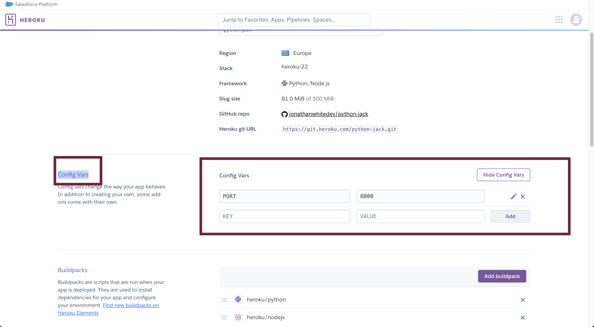

# Python Jack BlackJack Game

View my live project here! [PythonJack](https://python-jack.herokuapp.com/) 

Python Jack is a interactive app based website providing a terminal to play the popular casino game BlackJack. This condensed, easy to read, easy to play game can provide lots of fun to practice the game without using real money. 

Players of the game are given a $1000 playing amount and can bet against and compete with the computer. 

## How to play Python Jack

If a player gets an exact 21, the player wins against the dealer. Otherwise, in order to win, the sum of the player’s cards must be more than the sum of the dealer’s cards. Each face card has a definite value of 10, whereas the ace can be counted as 1 or 11 depending on the advantage this card brings to your hand. The value of the rest of the cards is defined by their number.

Standard casino rules:

Full BlackJack casino rules can be found at this link: [bicyclecards](https://bicyclecards.com/how-to-play/blackjack/)

-__Player is given a $1000 kitty added to their bank at the start of the game, this can be used in any increments of $1 to the full $1000. A waged bet of any amount ($1000) starts the game__

-__Player vs Dealer:__

-__Both dealt two cards, with the Dealer having one face down (hidden).__

-__Player goes first, and chooses if they want to hit or stay using the "H" or "S" key on keyboard.__

-__Double Down option:__
Player may enter additional wager up to, but not greater than original wager.
If chosen, player receives one more card, and only one more card.
Option to Split if both cards have same value:
If chosen, player may place down an additional wager, for the second hand.
The second wager can be up to, but no greater than original wager
Player is able to double down after splitting as well.

-__If upon hit, the player's hand sums to over 21, player loses.__

-__Dealer must continue hitting, until sum of hand is at least 17. If over 21, dealer busts, and player wins!__

-__If initial two cards dealt add to 21, player has BlackJack and is paid at 1.5:1 wager placed (eg: getting a BlackJack on an $100 wager would earn $150)__

-__Any standard win(not BlackJack): the hand is paid 1:1 as a match of wager placed for that hand.__

-__Your bank is updated after each game through wins and losses__

-__Player may leave the game with winnings at the end of any settled bets.__

## User Stories and UX

- __As a visiting user, I would like a Casino themed game readily available.__

As part of the UX specification and planning phase, it was noted that there was a lack of free resources to play and practice games such as blackjack online in a safe enviroment, totally ad free .

- __As a visiting user, I would like a free blackjack related games.__

Over three quarters of those surveyed (100), also came to agreement there were not many casino games that were free and didn't require signup.

- __As a visiting user, I would like something easy to use.__

Another shortfall noted was that many casino games such as blackjack online were extremely spam orientated, with many adverts spilling into the game and detracting the user from reading them accurately. Even if some websites had little to no adverts, they were often jumbled and messy, or too full of distracting information that was not clean and easy to use. It was also observed that most users wanted a website that could be read on a mobile or tablet rather then a computer that had easy to read fonts no matter the display used. Almost all that were surveyed in the UX consulation stage agreed there was no one webbased format that provided an easy to use game online.

- __As a visiting user, I would like my scores to be calculated.__

Many of the people surveyed agreed they wanted a game that saved their progress after each go. We aim to make a simple scoring function that can handle complex additions easily and can be readily availabe to the user.

## Terminal (GitPod)
The built in Terminal in GitPod can be used to play this game. This was used for extensive testing of the game for deployment to Heroku.

## Terminal (Heroku)

The deployed project is playable via Heroku as shown below. This is the area visiters of the site will play. 

## Features 

Python Jack includes the following;

### Existing Features

- __Welcome and Balance__ 

  - At the beginning of every game, a print statement of current balance will be shown to the player to indicate their value of chips. The player will automatically be shown a balance of $1000 at the very beginning of the game. As the player progresses this will recalculate depending on winnings and losses and will update at the end of every game. The new balance will be shown to the player at the start of the next game versus the dealer. If the player losses all their money it will be game over and a message to confirm this will appear.

   

- __Another round__ 

  - When a player finshes a game they will be given the print message of "Would you like to play another round? Y/N" The player can select from keyboard either the Y or N key to continue or finish.

- __Cards__ 

- At the start of a game the player will be able to see their cards and the total calculated value of these cards. The dealers cards will also appear above the players.

- __Hidden Dealers Card__ 

- As with any BlackJack game, the dealers last card will always be hidden from the players view and this be displayed as the rearside of the playing card. Please see example below:
  

- __Hit, Stand, Double Down__ 

- As with any BlackJack game, the player has options to Hit (Ask for another card), Stick (stay with the cards and their values), or double down (bet more chips on this turn). A print statement will appear after the cards are drawn to confrim what player would like to do. 

This is further broken down as follows:

- __Hit__
The Hit option asks the dealer to draw anothe rcard from the deck to add to your already existing total.

- __Stand__
The Stand or Stick option tells the dealer you are hppy with the current value of your cards and you would like them to reveal theirs and continue with the game and your hand.
 

- __Double Down__
Double down option is a further way to bet a higher stake placed already on your bet. (Usually this is done if you have a weak hand as another card will be drawn from the pack to add to your total) You must place a bet that is less or equal to you first placed bet provided you have the funds.
 

- __Split__
The split option only appears when you have drawn two cards that are of the same value (eg two 2's, or two kings)
From here you can split these two cards into seperate bets and another card is drawn with them. Again a futher wager or bet must be placed to do so. Please see examples below:
 
 
 

- __Player Bust__
This happens when you have gone over 21 in value with your cards before the dealer.

- __Dealer Bust__
This happens when the dealer has gone over 21 in value and you win the draw.

- __Game Over__
Game Over only appears when you have run out of money or chips and cannot play at the table anymore.

- __Validation with Letters__
When prompted for an input from the user the user can either use a lowercaae or uppercase response to avoid confusion. If anything other then a letter appears and is entered, the computer will repeat the reponse for a letter.
.png)

- __Validation with Numbers__
When prompted for a Number input from the user the user can only enter a whole number. If this is not provided (either- letter, decimal place, negative, strings, above the chip bank value) a prompt will remind the user of their balance and what they need to enter.

### Future features Left to Implement

- A propmt to ask for users name, this could be used to keep highscores saved into a server so that others can compete against them.
- A login for users to save their details of winnings so they can use these again in future games could also be implemented.

## Wireframes
- I used LUCID chart for my wireframes and drew a rough flow chart of what I wanted my layout to look like with responses. I made sure to close the loop of all outcomes so that the game will restart when one has commenced. If given time i will add some more functions to my code such as a bank to give player $1000 at the start. [This was later realised and completed!!]

Flowchart

## Technology
__Various technologies were used in the entire process of building this website as follows;__
- Python. Python language was used 100% for the entireity of this project.
- Pylint. This was used as a command within GitPod to test for the functionality and check for errors and best praxtices in my code.
- GitHub and GitPod. Where my python code was written, ran, stored and testing carried out.
- Heroku. This was where the game application was also stored and deployed for palying the game.

## Testing 

I had several issues during making my code including getting the dealers hidden card to display, lots of indentation issues which were swiftly sorted out and many more. The issues i found during deployment are listed below:

- Cards.
Some issues were found and fixed with the cards not displaying properly in a row when 5 or more were drawn into the heroku site. This caused the cards to be squashed up and unreadable. I fixed this by making the cards dimensions smaller in the design.py file. This meant that 6 cards could be drawn moving on. Please see attached results of this:

Cards Issues (before)

Cards Issues (after)

- Spacing.
Lastly another issue with the dimensions of the Heroku app was the initial spacing around word sentences and cards that was pushing the game board up high and this was a slight pain for the user to read everything without scrolling up. I fixed this my removing the new line (\n) in my generic variable print statements and of course as above making the cards slightly smaller. See attached screenshots:

Space Issues (before)

Space Issues (after)

Overall, I am very happy with the testing outcomes with Pylint. This was the choice of PEP8 testing recommended to me by my mentor as it is a superior testing system and already built into GitPod.

Across all 6 files of python code I scored between 9-10 out of 10 with all erros or bugs fixed. There is notibly some issues with string length warnings that were not fixed. This is due to the fact that although I had tested split the print statements down into wither two statements or seperating the strings of text with double quotation marks ("") this only caused 2 sperate lines of messages to appear in the terminal which did not look professional and read coherantly as normal. This was deliberate in leaving these in place for this reason alone.

The website runs smoothly across all used devices with no glitches or errors.

### Performance Testing 

- Pylint as mentioned above was used for all my testing as recommended by my mentor. All errors were removed and some exceptions with strings were ignored as previously mentioned.

- In Heroku the application works efficiently and seamlessly.

Please see attached screenshots of test results from pyling in terminal:

Run.py

Deck.py

Design.py

Player.py

Dealer.py

Hand.py

 

### Test Cases (Validations)
__User places wager:__
1. At the beginning of the game the user is given a $1000 wager in chips to use to bet. When the user is asked how much they would like to bet they must input a whole number equal to or less then 1000. If anything other then a whole number is entered, the computer will give clues as to what is required as a valif input from the user. Please see attached screenshots below:

 
 

 __Hit Function Testing:__
 1. User chooses to "Hit" by placing a h or H as a command. Again this must be these in lower or uppercase as the request will be sent again.
 2. On correct input, user will recieve another card to their hand.

 

 __Stand Function Testing:__
 1. User chooses to "Stand" by placing a s or S as a command. This must be these in lower or uppercase as the request will be sent again.
 2. On correct input, user will recieve no more cards to their hand and the dealer deals themselves and finishes the game.

 

__Double Down:__
 1.  User chooses to "Double Down" by placing a d or D as a command. This must be these in lower or uppercase as the request will be sent again.
 2. On correct input, user will recieve the option to bet a further amount of chips and must place it to atleast equal of less then the original placed bet.
 3. Once wager has been placed the next card drawn by dealer will be revealed.

 

__Split:__
 1. If 2 cards of equal value appear in the hand for the user, they will be given the coice to split if they chose. User chooses to "Split" by placing a s or S as a command. This must be these in lower or uppercase as the request will be sent again.
 2. On correct input, user will recieve the option to bet a further amount of chips and must place it to atleast equal of less then the original placed bet.
 3. Once wager has been placed the original cards dealt are split into 2 seperate hands and the new first hand has a card drawn by dealer and the new value of this hand is shown.
 4. The user can chose again if to Hit, Stick or Double Down and repeat the process for this.
 5. Once this is complete the dealer draws a second card to the new second hand and the value is shown.
 6. The user can chose again if to Hit, Stick or Double Down and repeat the process for this.
 7. If these cards are successful double the winnings can be won and will be added to there wager.

 See below screenshots:

 
 
 

### Supported Browsers and Screen Sizes.
  - Testing was carried out on Google Chrome, Safari, and Mozilla Firefox. All rendered the content and was fast and reponsively across these browsers.
  - Testing was carried out on Macbook Pro M1 (Due to limitations with built in code this was not designed for smaller devices and IOS for iphones so was not able to properly test on mobile devices) 

### Unfixed Bugs

There were no bugs present that were unfixed. There were some recommendations as mentioned to fix the line length in some files but this was ignored for reasons already explained.

## Deployment
  - The site was deployed to Heroku and GitHub. The live link can be found here - https://python-jack.herokuapp.com/ and https://github.com/jonathanwhitedev/python-jack

  __To deploy the project to GitHub:__
   1. In the [GitHub repository](https://github.com/jonathanwhitedev/python-jack), Navigate to the settings tab (small red box in image below).
   2. Once in the settings, navigate to the pages tab on the left hand side.
   3. In the build and deployment section under Branch, select the "master" branch and click Save.
   4. Once the master branch has been selected, the page will be automatically refreshed and a display indicates the successful deployment and the link to the address as below.

    __To deploy the project to Heroku:__
   1. In the [Heroku Dashboard](https://dashboard.heroku.com/apps), Navigate to the new tab and click on it then click on create new app (small red box in image below).
   

   2. Once in the create, give the file a name and select your region and save the changes by clicking create app. (See red boxes)
   

   3. From here its time to connect to your GitHub code and repository. Click deply tab 1, navigate to step 2 and click GitHub. From here at step 3 you can now connect this to GitHub by enetering the name of the repository from there and clicking connect in bottom corner. See image below:
   

   4. Now it is time to config vars in the settings tab, scroll down to config vars and enter "PORT" in KEY and "8000" as the Value.
   

   5. Lastly connect the languages you have used in GitHub to Heroku by remaining in the settings tab and scrolling doen to "Buildpacks" from here click on "add buildpack" And select "python" and "nodejs" and once highlighted save these changes. 
   

   6. From here you are now ready to launch the app in the Heroku deployment terminal to play the game or test.
   

### Extra Deployment Tasks
 __To run the website on a local screen:__
   1. Go to the [GitHub repository](https://github.com/jonathanwhitedev/python-jack).
   2. Once in there, click on the green Code button and Download ZIP.
   3. Extract the ZIP file on your local machine.
   4. Run the index.html file in a browser.

 __To clone the repo:__
   1. Go to the [GitHub repository](https://github.com/jonathanwhitedev/python-jack).
   2. Click on the green Code button and directly underneath as shown, copy the HTTPs link there.
   3. Open a GitBash terminal and navigate to the directory where you want to locate the clone.
   4. Type "git clone" and paste the copied HTTPs link, press the enter key to begin the clone process.

   

## Credits 

Again I would firstly like to credit my fiancé, Toni, who kept the house in order whilst I spent 16 hours a day at times on this python project!!

I would like to credit the following links and websites that helped me build this game:

1. APHRX on YouTube (https://www.youtube.com/watch?v=C82s5WufNUA&t=215s)
This helped me greatly in various areas to implement and structure my code.

2. The following webiste was also a massive help and resource for helping me define functions and get designs for my cards 
(https://www.askpython.com/python/examples/blackjack-game-using-python)

3. Also (https://bicyclecards.com/how-to-play/blackjack/) which helped me clarify the rules for making this game!

Lastly I would like to thank my mentor, Rohit, for helping impeccably as always with his wisdom and guidance which was very helpful and greatly appreciated indeed.

Content and media inspiration is as follows below;

### Content 

_ The following as already mentioned helped me get to grips with how to approach the coding of this game, I would most likely be lost without it:

1. APHRX on YouTube (https://www.youtube.com/watch?v=C82s5WufNUA&t=215s)
This helped me greatly in various areas to implement and structure my code.

2. The following webiste was also a massive help and resource for helping me define functions and get designs for my cards 
(https://www.askpython.com/python/examples/blackjack-game-using-python)

### Media

- All media in this file are from screenshots from testing.

## Thank you for taking the time to view my README file, hope you enjoy the BlackJack! 

## Jonathan White